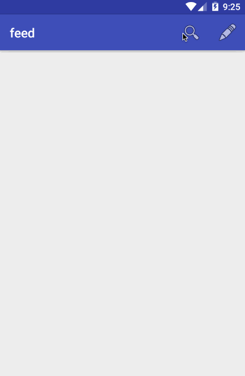

# feed
Simple news reader app for Android

Time spent: 15 hours in total

### Completed user stories:

- [x] Required: User can enter a search query that will display a grid of news articles using the thumbnail and headline from the New York Times Search API
- [x] Required: User can click on "settings" which allows selection of advanced search options to filter results
- [x] Required: User can configure advanced search filters such as news desk values, begin date, and sort order
- [x] Required: Subsequent searches will have any filters applied to the search results
- [x] Required: User can tap on any article in results to view the contents in an embedded browser
- [x] Required: User can scroll down "infinitely" to continue loading more news articles
- [x] Optional: Use the ActionBar SearchView or custom layout as the query box instead of an EditText
- [x] Optional: User can share a link to their friends or email it to themselves
- [x] Optional: Replace Filter Settings Activity with a lightweight modal overlay
- [x] Optional: Apply ButterKnife to reduce view boilerplate
- [x] Optional: Use Parcelable instead of Serializable using the popular Parceler library
- [x] Optional: Replace Picasso with Glide for more efficient image rendering

### Walkthrough for all user stories:

GIF created with [LiceCap](http://www.cockos.com/licecap/).

Credits
---------
* Article Search API from [New York Times](http://developer.nytimes.com/docs/read/article_search_api_v2)
* [android-async-http](http://loopj.com/android-async-http/)
* [Glide](https://github.com/bumptech/glide)
* [Butterknife](http://jakewharton.github.io/butterknife/)
* [GSON](https://github.com/google/gson)
* Icons from [Iconmonstr](http://iconmonstr.com/)
